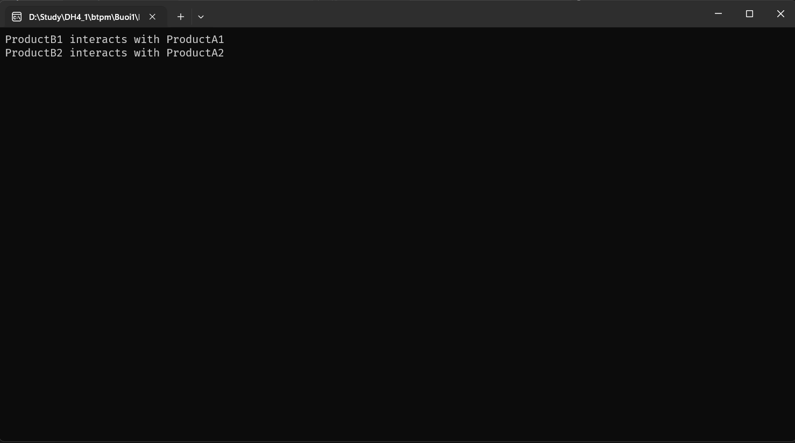
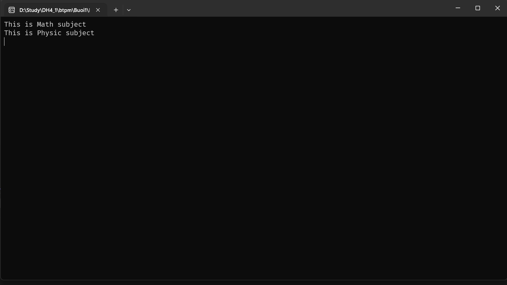

# design_pattern_example

Đây là một dự án nhỏ nhằm minh họa việc áp dụng **Design Pattern** trong lập trình.  
Dự án chỉ mang tính chất **bài tập thực hành trên lớp** và không được sử dụng trong môi trường sản xuất.

## Nội dung

Dự án bao gồm 3 ví dụ chính:

1. **Abstract Factory – Ví dụ 1**  
   - Minh họa cách sử dụng Abstract Factory để tạo ra các đối tượng mà không cần chỉ rõ lớp cụ thể.  
   - Kết quả: chương trình có thể tạo ra các đối tượng thuộc nhiều "họ sản phẩm" khác nhau mà vẫn đảm bảo tính mở rộng.

2. **Abstract Factory – Ví dụ 2**  
   - Một cách triển khai khác của Abstract Factory, giúp người học thấy rõ tính linh hoạt của mẫu thiết kế này.  
   - Kết quả: dễ dàng thay đổi cấu hình hoặc thêm họ sản phẩm mới mà không ảnh hưởng đến code hiện có.

3. **Ví dụ tự làm**  
   - Bài tập tự triển khai dựa trên sự hiểu biết về Design Pattern.  
   - Kết quả: chương trình chạy đúng logic mong muốn, giúp củng cố kiến thức về cách áp dụng pattern vào tình huống thực tế.

## Kết quả đạt được

- Hiểu rõ hơn về cách **Abstract Factory Pattern** hoạt động.  
- Thấy được ưu điểm của việc sử dụng **Design Pattern**: dễ mở rộng, dễ bảo trì, giảm phụ thuộc lẫn nhau giữa các lớp.  
- Có thêm trải nghiệm tự xây dựng một ví dụ riêng, từ đó rèn luyện tư duy thiết kế phần mềm.